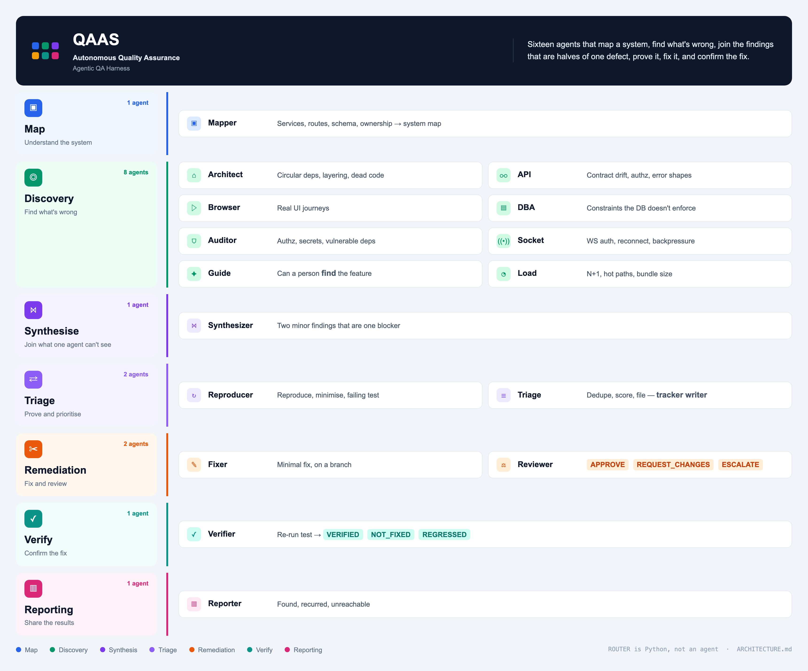
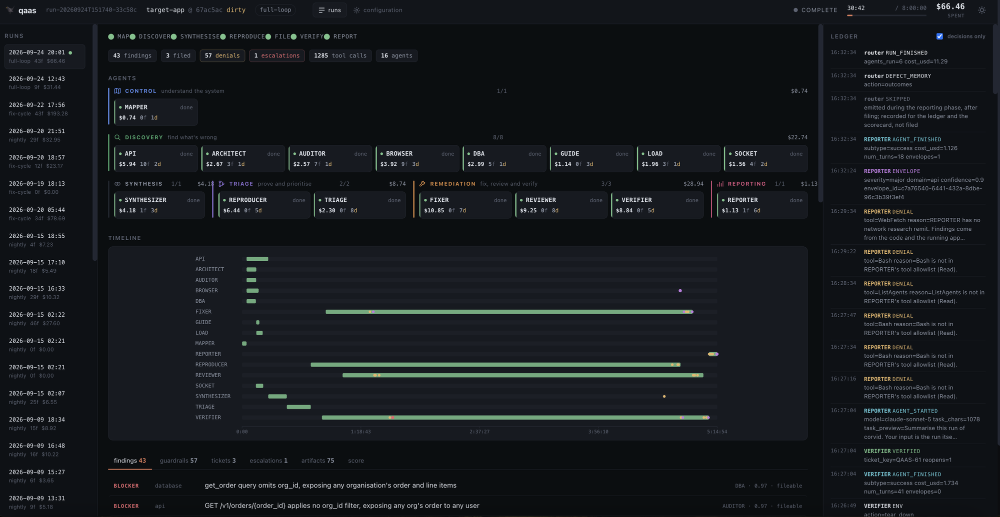

<p align="center">
  
</p>

<h1 align="center">qaas</h1>

<p align="center">
  <em>Sixteen governed Claude Code sessions that read your repository, find
  defects, reproduce them into failing tests, file them, fix them and verify
  the fix.</em>
</p>

<p align="center">
  <a href="https://pypi.org/project/qaas-python/"></a>
  
  
</p>

---

## Contents

1. [What it is](#what-it-is)
2. [Install](#install)
3. [Quick start](#quick-start)
4. [How a run works](#how-a-run-works)
5. [Run modes](#run-modes)
6. [What you get](#what-you-get)
7. [Why it is safe to point at your code](#why-it-is-safe-to-point-at-your-code)
8. [Pointing it at your own project](#pointing-it-at-your-own-project)
9. [Filing into Jira](#filing-into-jira)
10. [Opening pull requests on GitHub](#opening-pull-requests-on-github)
11. [The dashboard](#the-dashboard)
12. [Does it actually find things?](#does-it-actually-find-things)
13. [Customising it](#customising-it)
14. [Command reference](#command-reference)
15. [Troubleshooting](#troubleshooting)
16. [What's new in 0.0.2](#whats-new-in-002)
17. [Roadmap and contributing](#roadmap-and-contributing)

---

## What it is

`qaas` is a harness **around Claude Code**, not a program that calls an API.

Each agent is a real Claude Code session: its own process, its own context, its
own tool allowlist, its own budget. A Python state machine — the router — runs
them in order and can refuse any tool call any of them makes. That is what makes
the per-agent cost, the context boundary and the write-permission matrix real
rather than bookkeeping: they are separate operating-system processes with
separate permissions.

<p align="center">
  
</p>

| Agent | Phase | What it is for |
|---|---|---|
| **MAPPER** | Map | Services, routes, schema and ownership → the shared system map |
| **ARCHITECT** | Discover | Dependency cycles, layering violations, dead code |
| **API** | Discover | Contract drift, missing authorization, inconsistent errors |
| **BROWSER** | Discover | Real UI journeys, driven in a browser |
| **DBA** | Discover | Constraints the application assumes and the database does not enforce |
| **AUDITOR** | Discover | Authorization, committed secrets, vulnerable dependencies |
| **SOCKET** | Discover | WebSocket auth, reconnect, backpressure |
| **GUIDE** | Discover | Whether a person can actually find and use the feature |
| **LOAD** | Discover | N+1 queries, hot paths, unbounded results |
| **SYNTHESIZER** | Synthesise | The defect that is two findings until someone joins them |
| **TRIAGE** | File | Dedupe, score, file — the only agent that writes to a tracker |
| **REPRODUCER** | Verify loop | Minimise it, write the failing test, measure the flake |
| **VERIFIER** | Verify loop | Re-run the original test → VERIFIED / NOT_FIXED / REGRESSED |
| **FIXER** | Verify loop | The smallest fix, on its own branch |
| **REVIEWER** | Verify loop | Adversarial review: root cause or symptom? |
| **REPORTER** | Report | What was found, what recurred, what nothing reached |

---

## Install

```bash
pip install qaas-python            # the CLI and the import package are both `qaas`
pip install "qaas-python[ui]"      # adds `qaas dashboard`
```

**Requirements**

| | |
|---|---|
| Python | 3.12 or newer |
| Model access | Signed in to Claude Code (`claude`), or `ANTHROPIC_API_KEY` set. The Claude Code binary ships with the SDK — nothing else to install. |
| Browser agents *(optional)* | `npx -y @playwright/mcp@0.0.82 install-browser chrome-for-testing` — only for BROWSER and GUIDE. Needs Node.js. |
| Shell sandbox | Built in on macOS. On Linux: `sudo apt-get install bubblewrap socat`. |
| Demo app *(optional)* | Docker, for `target-app/` in this repository |

`qaas doctor` checks all of these for the target you point it at and says what
is missing.

---

## Quick start

```bash
cd your-project
qaas init .                          # writes .qaas/ and a target profile
qaas doctor                          # what this target makes possible
qaas run --mode pr-check --dry-run   # the whole plan: no API call, no money
qaas run --mode pr-check             # a real run
qaas show <run-id>                   # what it found, what it cost
```

Or point it at any repository without setting anything up first:

```bash
qaas run --repo https://github.com/someone/their-project --mode nightly
```

`--dry-run` renders every agent's model, turn cap, tool allowlist and prompt size
without spending anything. Run it before the first paid run, and after any change
to a prompt or a policy.

---

## How a run works

```
map    -> discover      -> synthesise  -> file   -> verify loop (per ticket) -> report
MAPPER    API/BROWSER/…    SYNTHESIZER    TRIAGE    REPRODUCER -> VERIFIER      REPORTER
                                                    FIXER -> REVIEWER -> VERIFIER
```

1. **Map.** MAPPER reads the repository once and publishes a versioned system
   map every other agent reads.
2. **Discover.** The discovery agents run concurrently. Each is a specialist
   that can only read — the finder never fixes.
3. **Synthesise.** SYNTHESIZER reads every finding and joins the ones that are
   one defect seen from two sides (an endpoint with no org filter *and* a table
   with no owning-org constraint is one cross-tenant leak, not two minor issues).
4. **File.** TRIAGE dedupes against everything filed before, scores, and files
   tickets.
5. **Verify loop, one ticket at a time.** REPRODUCER writes the failing test;
   VERIFIER confirms it fails; FIXER writes the smallest fix on its own branch;
   REVIEWER reviews it adversarially; VERIFIER re-runs the original test. A
   ticket ends **VERIFIED**, or is handed to a human — never looped forever.
6. **Report.** REPORTER summarises what was found, fixed, and left.

**Escalation is a designed ending, not a failure.** Some tickets are a product
question no model can answer — *this fix is correct, but it breaks the orders
page, which has no paging: ship now or hold?* The run says so and stops working
that ticket until you answer:

```bash
qaas escalations                                        # what is waiting on you
qaas answer QAAS-60 --decision proceed --note "add paging in the same PR"
qaas answer QAAS-31 --decision hold    --note "outside FIXER's paths; mine"
```

An answer records one line in the run's ledger and dispatches nothing; your note
reaches FIXER and REVIEWER verbatim on the next cycle.

**Stopping and resuming.** Every run can be resumed with
`qaas run --mode <mode> --run-id <run-id>`. A resume skips everything already
done — the map, finished agents, filed tickets, verified tickets, and tickets
waiting on your answer — and keeps the run's ticket cap.

**Provider usage limits.** When Claude Code reports a session limit and says
when it resets ("resets 3:50pm"), the run **waits for the reset and retries the
agent it stopped**, as long as the reset falls inside the run's own time limit.
Nothing else is dispatched into the limit while it waits. If it cannot wait, it
stops cleanly and prints the resume command.

---

## Run modes

| Mode | Agents | Wall clock | Files tickets | Use it for |
|---|---|---|---|---|
| `pr-check` | 8 | 15 min | yes | Every pull request |
| `nightly` | 13 | 2 h | yes | A scheduled sweep: find, reproduce, file |
| `incident` | 1 | 10 min | no | A quick diagnostic |
| `fix-cycle` | 3 | 4 h | yes | Fix and verify tickets already filed |
| `full-loop` | 16 | 8 h | yes | Everything, end to end |

Useful flags on `qaas run`:

| Flag | What it does |
|---|---|
| `--dry-run` | Build every agent's options and stop. Free. |
| `--only API --only DBA` | Restrict the run to named agents |
| `--target <name>` / `--repo <path-or-url>` | Choose what to run against |
| `--run-id <id>` | Resume a run |
| `--ticket QAAS-12` | Restrict a `fix-cycle` to named tickets |
| `--from-board "Ready for Fix"` | Take the tickets from a Jira column: drag a card there and the next run picks it up |
| `--dashboard` | Serve the live dashboard alongside the run |

---

## What you get

- **A run ledger** — every tool call, refusal, escalation and verdict, append-only,
  on disk under `.qaas/runs/<run-id>/`. `qaas trace <run-id> --follow` streams
  it; `qaas dashboard` renders it.
- **Defect envelopes, not prose.** Agents never hand each other paragraphs. One
  validated type crosses every boundary, with two gates built into it: a finding
  needs evidence, and it needs confidence above the filing threshold. Findings
  that fail are held, not filed.
- **Failing tests, not bug reports.** REPRODUCER writes the shortest test that
  makes the defect appear, runs it several times to measure flake, and commits it
  on its own branch. A finding it cannot reproduce is demoted.
- **Tickets** in Jira or in a local file-backed tracker, deduplicated across runs
  by a structural fingerprint that ignores prose, line numbers and timestamps.
- **Fixes** on their own branches, reviewed adversarially and verified against
  the original failing test before anything is closed. **Nothing merges** —
  merging is a human decision and there is no code path to it.
- **A memory across runs.** A defect seen before is recognised; one whose fix
  was merged and that comes back is reported as a regression. A fix that is
  verified but not yet merged is not mistaken for one.

---

## Why it is safe to point at your code

Every agent's permissions are declared in its config and **enforced in Python
before the tool runs** — not requested in a prompt.

- **Discovery agents cannot write at all.**
- **FIXER writes to source and cannot touch the test that defines success**, nor
  migrations, auth, payment paths, secrets or CI config. It is also bounded by a
  diff budget (files and lines) per ticket.
- **The shell cannot go around the rules.** Commands are parsed for what they
  write; a command that mutates and whose destination cannot be resolved is
  refused. `git push --force`, pushes to protected branches and merges are
  refused outright.
- **The shell runs in an OS sandbox** (Seatbelt on macOS, bubblewrap on Linux):
  writes only inside the checkout and a private temp directory, no reads of
  `~/.ssh`, `~/.aws`, `~/.config/gh` or other credential stores, and network
  only to your application.
- **Your credentials stay yours.** Agents get an environment with Jira, GitHub
  and other tokens blanked; the target's own test suite runs with an allowlisted
  environment.
- **Nothing is loaded from the target's settings.** A repository cloned from a URL
  cannot inject hooks or MCP servers into the process holding your API key.
- **Security findings are never filed where everyone can read them** — they need a
  restricted Jira project, and a fix for one is committed but never pushed.

Every refusal is logged with its reason, and the agent adapts; the turn does not
die.

---

## Pointing it at your own project

A **target profile** makes the system portable: nothing in any prompt names a
specific application. `qaas init` writes one by reading your repository and tells
you what it guessed.

```yaml
name: my-service
root: .
layout:
  backend: [api]
  frontend: [web]
  spec: openapi.yaml
environment:
  mode: compose          # none | external | compose
  api_url: http://localhost:8000
  web_url: http://localhost:5173
auth:
  mode: login
  login_endpoint: POST /v1/auth/login
  roles:
    admin: {username: admin@example.test, password_env: DEMO_ADMIN_PASSWORD}
```

| `environment.mode` | Meaning |
|---|---|
| `none` | Static reads only |
| `external` | Agents may exercise the running app but never reset it — someone else may rely on it |
| `compose` | This run owns the lifecycle: it may build, seed, reset and tear down |

Credentials are never written into a profile; it names environment variables.

**Set the diff budget on a real codebase.** FIXER ships with a five-file,
150-line limit on how much production code it may change before a human sees it.
In a codebase whose defects are duplication, a correct fix touches every
duplicate. Raise (or lower) it per target:

```yaml
diff_budget: {max_diff_files: 12, max_diff_lines: 400}
```

When a fix genuinely exceeds the budget, the run escalates saying it is *wider
than the envelope, not wrong*.

---

## Filing into Jira

```bash
# .qaas/.env — read by every command; anything already exported wins
JIRA_BASE_URL=https://you.atlassian.net
JIRA_EMAIL=bot@example.com
JIRA_API_TOKEN=...                   # an API token, not a password
JIRA_PROJECT_KEY=QA
JIRA_SECURITY_PROJECT_KEY=QASEC      # optional: a restricted project for security findings
```

```bash
QAAS_TRACKER=jira qaas tracker-check   # validates everything, creates nothing
QAAS_TRACKER=jira qaas run --mode nightly
qaas board                             # this repository's board
```

- **Use a dedicated bot account** with *Browse*, *Create*, *Transition* and
  *Link* permissions on the project. Jira Cloud only.
- **`tracker-check` first.** It confirms the credentials, the project and issue
  type, maps your workflow's statuses, and prints the exact request it *would*
  send.
- **One view per repository.** Every ticket carries a `repo-<target>` label, and
  `qaas board` finds or creates a saved filter (and a board, where the project
  allows one) over exactly that label.
- **Dedupe across runs.** Tickets carry a fingerprint label, so next week's run
  recognises a defect it already filed instead of filing it again.
- **Security findings are refused** unless `JIRA_SECURITY_PROJECT_KEY` names a
  restricted project: filing a vulnerability where the whole company can read it
  is a disclosure with no undo.

`.qaas/.env` is gitignored by `qaas init`. The default tracker is `local`, which
writes tickets as JSON under `.qaas/tickets/` so you can see what *would* be filed.

---

## Opening pull requests on GitHub

The default is `vcs: local`: fixes are committed to branches in your checkout and
nothing is pushed. To have FIXER push its branch and open a **draft** pull
request, set `vcs: github` in `.qaas/config/system.yaml` (or `QAAS_VCS=github`)
and authenticate the GitHub CLI with `gh auth login`. Protected branches can
never be pushed to, security fixes are never pushed, and nothing is ever merged.

---

## The dashboard

```bash
pip install "qaas-python[ui]"
qaas dashboard                 # the latest run, at http://127.0.0.1:7777
qaas dashboard <run-id>        # a specific run
qaas run --mode nightly --dashboard   # serve it alongside a run
```

<p align="center">
  
</p>

It shows the phases, one card per agent (cost, findings, refusals), the
findings, tickets, escalations and a live feed of the ledger — and the
installation's configuration.

| Card | Meaning |
|---|---|
| Green — *done* | The agent's latest invocation succeeded |
| Red — *failed* | The agent failed |
| Amber — *waiting* | A provider usage limit is being waited out; the card says when it retries |
| Amber — *rate-limited* | The run stopped on a usage limit it could not wait out; the card shows the resume command |
| Amber — *interrupted* | The process running it was stopped before it finished |

It binds to localhost only and reads the ledger; the one thing it can write is
*tuning* — which model an agent runs, a turn cap, a threshold — never an agent's
permissions.

---

## Does it actually find things?

`qaas score` answers that with numbers.

This repository ships `target-app/`, a deliberately buggy FastAPI + React
application, and `target-app/defects.yaml`, a golden ledger of exactly what is
wrong with it — plus correct-but-suspicious code, so precision is measured rather
than assumed. Matching is deterministic, not model-judged.

```bash
cd target-app && docker compose up -d
qaas run --mode nightly
qaas score                       # recall, precision, false positives — per agent
qaas sweep --min-precision 0.7   # run + score + exit non-zero below the gate (the cron line)
```

The latest full-loop run on the demo app found **19 of 21** seeded defects
(90% recall), filed three tickets and verified two fixes, for about $66.

---

## Customising it

**Agents are data.** An agent is a prompt file plus a YAML file; adding one needs
no Python.

```bash
qaas prompts list                # every prompt and which layer it came from
qaas prompts eject API           # copy it into .qaas/prompts/ to edit
qaas prompts diff                # what you changed against what ships
```

**Config layers the ordinary way:** `--config` beats your project's `.qaas/config/`,
which beats what ships. Agent files, prompts and skills merge by name, so changing
one agent is one dropped-in file. `.qaas/config/overrides.yaml` changes single
values without forking anything:

```yaml
thresholds:
  max_tickets_per_run: 10        # stop filing after this many tickets per run
  min_confidence_to_file: 0.7    # file fewer, surer findings
  quota_wait_max_s: 21600        # longest to wait for a usage limit to reset (0 = never)
agents:
  FIXER: {max_budget_usd: 20, max_turns: 120}
```

**Sandbox:** `sandbox.mode` in `system.yaml` is `auto` (sandbox where the OS can),
`required` (refuse to run unsandboxed) or `off`.

---

## Command reference

| Command | What it does |
|---|---|
| `qaas init <repo>` | Scaffold `.qaas/` and a target profile |
| `qaas targets` | List the target profiles this project can see |
| `qaas doctor [--target X]` | What a target makes possible, and what is missing |
| `qaas validate` | Check config, prompts and tool allowlists — no API call |
| `qaas run --mode M` | Run. Costs money unless `--dry-run` |
| `qaas runs` | Recent runs with cost and finding count |
| `qaas show <run-id>` | One run's findings, tickets, escalations and cost |
| `qaas trace <run-id> [--follow]` | The ledger as a timeline |
| `qaas map` | The system map MAPPER produced |
| `qaas dashboard [<run-id>]` | The live run view in a browser |
| `qaas escalations` | What is blocked on a human, across runs |
| `qaas answer <TICKET> --decision proceed\|hold --note "..."` | Answer an escalation |
| `qaas score [<run-id>]` | Recall and precision against the golden ledger |
| `qaas sweep` | Run, score, and fail below a precision gate |
| `qaas board` | Show or create this repository's Jira board |
| `qaas tracker-check` | Validate the tracker configuration; creates nothing |
| `qaas prompts list / eject / diff` | Inspect and override agent prompts |

Every command takes `--help`.

---

## Troubleshooting

| Symptom | Fix |
|---|---|
| BROWSER and GUIDE are skipped with "browser … is not installed" | `npx -y @playwright/mcp@0.0.82 install-browser chrome-for-testing` |
| `qaas doctor` says the sandbox is unavailable (Linux) | `sudo apt-get install bubblewrap socat` |
| A run stopped on "session limit" | Wait for the reset, then run the resume command it printed. Runs wait by themselves when the reset falls inside their time limit. |
| "no target profile" | Run `qaas init .` in the project, or pass `--target` / `--repo` |
| A fix escalated as "wider than the envelope" | Raise `diff_budget` in the target profile, or split the ticket |
| Security findings are not filed | Set `JIRA_SECURITY_PROJECT_KEY` to a restricted project |
| Anything else | `qaas doctor`, then `qaas trace <run-id>` — every refusal says why |

---

## What's new in 0.0.2

- **Sixteen agents** — ARCHITECT, DBA, AUDITOR, SOCKET, GUIDE, LOAD and
  SYNTHESIZER join the roster, and a verify loop (REPRODUCER → VERIFIER → FIXER →
  REVIEWER → VERIFIER) that runs per ticket.
- **An OS sandbox around every agent's shell**, credentials blanked in agents'
  environments, and a shell-command guardrail that git's global options, wrappers
  and indirection can no longer get around.
- **Escalations you can answer** (`qaas escalations`, `qaas answer`), and
  `--from-board` to take work from a Jira column.
- **Resumable runs that do only what is left**, including the ticket cap, and
  **usage limits waited out** instead of failing the run.
- **A browser check** before BROWSER and GUIDE run, a headless browser, and the
  correct install command.
- **Memory that knows merged from verified:** a fix waiting to be merged is not
  reported as a regression when the defect is seen again.
- **The dashboard** — phases, agent cards, findings, tickets, escalations and a
  configuration view; rate-limited agents drawn amber, never as failures.
- **Per-agent scoring** with `qaas score`, and `qaas sweep` as a precision gate.

---

## Roadmap and contributing

`qaas` runs on the Claude Agent SDK today. Making the model a *choice* is the
next step, and the most useful place for help: a provider interface in the
runner, a second implementation behind it, local models for the agents that do
not need a frontier one, and a scored per-agent model comparison with
`qaas score` as the referee.

Issues and pull requests are welcome — especially a new agent (a prompt plus a
YAML file), or simply running `qaas` against your own repository and reporting
what it got wrong.

```bash
git clone https://github.com/allaabdella2-us/qa-multi-agent-system
cd qa-multi-agent-system
uv venv && uv pip install -e ".[dev]"

pytest -q                              # 1602 tests, offline, free, no API key
qaas validate                          # config, prompts and allowlists cohere
qaas run --mode pr-check --dry-run     # every agent's options assemble
```

Those three are the whole CI gate. The default test run makes no API calls and
touches no network. If you change a seeded defect in `target-app/`, change its
entry in `defects.yaml` in the same commit.

---

**Status:** 0.0.2, beta. **License:** MIT.
