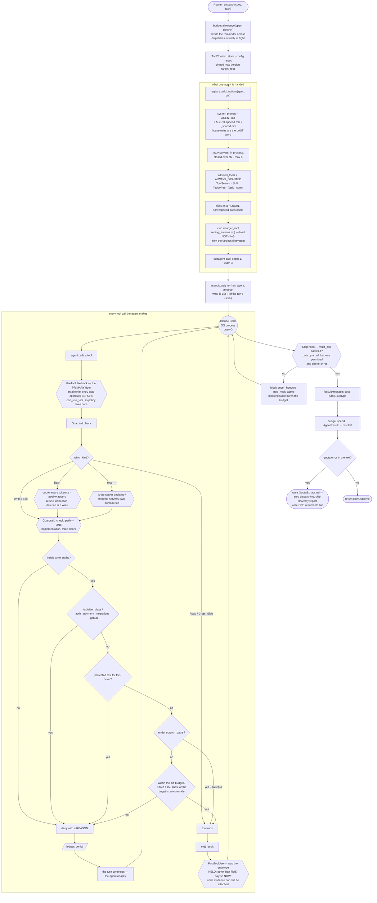
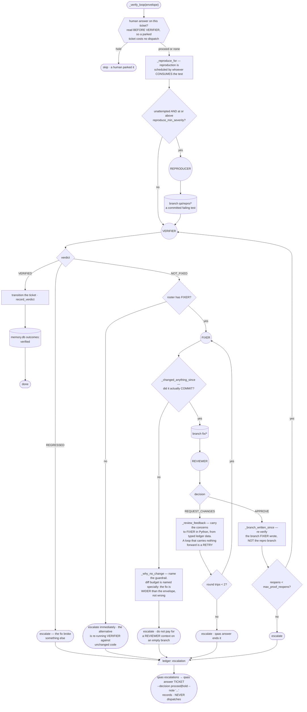

# Understanding qaas-python, end to end

A single answer sheet for the twelve questions, written against the source as it
stands today (16 agents, 7 in-process MCP servers, 30 skills, 1,126 tests).

Where a number or a name appears here it came out of the code, not out of a
design document. `ARCHITECTURE.md` walks the code, `MANUAL.md` is the command
reference, `qa-agent-system-architecture.md` is the design the code cites by
section (`§8.1`, `§5.3`), and `CLAUDE.md` is the working contract. This file is
the orientation layer above all four.

---

## 0. The one-paragraph version

`qaas` is **a harness around Claude Code, not a program that calls an API.**
Sixteen agents read a target application, find defects, join the ones that
belong together, reproduce them into failing tests, file tickets, fix them and
verify the fix. Each agent is a real Claude Code session — its own OS process,
its own context, its own tool allowlist, its own budget — and a **Python state
machine** decides the order they run in and may refuse any tool call any of them
makes. The model does the judging. Python does the governing. That split is the
whole architecture; almost every design decision below follows from it.

---

## 1. What is the backend code architecture?

### 1.1 The two facts that shape everything else

**ROUTER is Python, not a prompt.** `src/qaas/router.py` is an ordinary asyncio
state machine: phase ordering, concurrency, the spend and wall-clock governor,
the §8.3 loop breakers, escalation. *A model cannot enforce a budget it is itself
spending.* There is no LLM anywhere in the control path.

**Each agent is its own top-level `query()`** — not an SDK subagent — and that
`query()` spawns a Claude Code process. That is what makes the context boundary,
the tool allowlist and the per-agent cost number real rather than bookkeeping:
they are separate operating-system processes. (`agents=`/`AgentDefinition` is
used only for intra-agent fan-out, and even that is capped — see §11.)

### 1.2 The layers

```
                      ┌──────────────────────────────────────────────┐
  CLI  cli.py ───────►│  ROUTER  router.py     (Python state machine) │
  2,700 lines         │  phases · concurrency · budget · escalation   │
                      └───────────────┬──────────────────────────────┘
                                      │ one dispatch = one agent
                      ┌───────────────▼──────────────────────────────┐
                      │  RUNNER  runner.py    one top-level query()   │
                      │  REGISTRY registry.py spec ──► ClaudeAgentOptions │
                      └───────────────┬──────────────────────────────┘
                                      │  OS process: Claude Code
   ┌──────────────────────────────────┼───────────────────────────────┐
   │  system prompt   MCP servers     │  hooks          allowlist      │
   │  prompts/*.md    mcp/*.py        │  PreToolUse     build_allowed_ │
   │  + _shared.md    7 in-process    │  PostToolUse    tools()        │
   │  + skills plugin + playwright    │  Stop                          │
   └──────────────────────────────────┼───────────────────────────────┘
                                      │ every path-taking call
                      ┌───────────────▼──────────────────────────────┐
                      │  GUARDRAILS guardrails.py  §8.1 write matrix  │
                      │  one _check_path(), three doors               │
                      └───────────────┬──────────────────────────────┘
                                      │ append-only
                      ┌───────────────▼──────────────────────────────┐
                      │  STORE store.py  .qaas/runs/<id>/ledger.jsonl │
                      │  envelopes/ artifacts/ results/ memory.db     │
                      └───────────────┬──────────────────────────────┘
                                      │ read-only
                      ┌───────────────▼──────────────────────────────┐
                      │  READERS trace.py · ui/ (dashboard) · scorecard│
                      └───────────────────────────────────────────────┘
```

### 1.3 The phase pipeline

```
map    ─►  discover        ─► synthesise ─► file   ─► verify ──────────────► report
MAPPER     API/BROWSER/DBA/   SYNTHESIZER    TRIAGE    REPRODUCER ─► VERIFIER   REPORTER
           AUDITOR/SOCKET/                             (per ticket, inside the loop)
           GUIDE/LOAD/ARCHITECT
```

The phases exist because the dependencies are real, not for tidiness: discovery
cannot start without the map; triage cannot start without findings. **Within a
phase, agents are independent and run concurrently** up to the mode's
`max_concurrency`.

Two dispatch rules, and the difference matters:

| dispatch | phases | consequence |
|---|---|---|
| **by LAYER** | discovery, synthesis, reporting | adding an agent is a prompt file + a YAML file and **no Python** |
| **by NAME** | map, triage, reproduce, file, verify, remediation | those agents name tools only they have |

`_phase_discover` falls back to `tasks.discovery` for anything without a bespoke
builder. DBA and AUDITOR were added by prompt and YAML alone — and discovered
that this had *not* been true before them: the phase dispatched from a closed
dict, so a new discovery agent validated, assembled, appeared in `--dry-run`, and
silently did nothing. `test_every_shipped_agent_is_actually_dispatchable` holds
that line now.

### 1.4 The run modes

| mode | agents | wall clock | concurrency | files tickets |
|---|---|---|---|---|
| `pr-check` | MAPPER, ARCHITECT, API, BROWSER, DBA, AUDITOR, REPRODUCER, TRIAGE | 900 s | 2 | yes |
| `nightly` | + SOCKET, GUIDE, LOAD, SYNTHESIZER, REPORTER | 7,200 s | 3 | yes |
| `incident` | API only | 600 s | 2 | **no** (diagnostic) |
| `fix-cycle` | VERIFIER, FIXER, REVIEWER | 14,400 s | 1 | yes |
| `full-loop` | all 16 | 28,800 s | 3 | yes |

### 1.5 The single inter-agent type

`envelope.py`. **Agents never pass prose to each other.** A `DefectEnvelope` is
validated on write and on read, `extra="forbid"` everywhere. Two gates live on
the model rather than in a prompt:

- `has_evidence()` — an artifact or a failing test
- `is_fileable()` — evidence + confidence ≥ threshold + not `not_reproducible`

`fingerprint()` deliberately excludes prose, line numbers, commit sha and
timestamps, so the same defect found twice hashes the same.

---

## 2. Which agents depend on each other?

### 2.1 The dependency graph

```
                         MAPPER  (publishes the system map, versioned + pinned)
                            │
        ┌───────────┬───────┼────────┬────────┬────────┬────────┬────────┐
     ARCHITECT     API   BROWSER    DBA    AUDITOR  SOCKET   GUIDE    LOAD
     (static)   (contract)(UI)   (schema)(security)(realtime)(UX)   (perf)
        └───────────┴───────┴────────┴───┬────┴────────┴────────┴────────┘
                                         │  all emit DefectEnvelopes
                                         ▼
                                   SYNTHESIZER   reads EVERY envelope; joins
                                         │       cross-surface defects
                                         ▼
                                      TRIAGE      the ONLY agent with tracker
                                         │        write access → tickets
                                         ▼
                            ┌────────  VERIFIER  ◄──────────┐
                            │            │                   │
                    REPRODUCER           │ NOT_FIXED         │ re-verify
                  (per ticket, in-loop)  ▼                   │
                            │          FIXER ──► REVIEWER ───┘
                            │   (writes code)  (never writes code)
                            ▼
                        REPORTER  (audits the RUN, never the application)
```

### 2.2 Dependency table

| agent | layer | needs | is needed by | hard contract (`must_call`) |
|---|---|---|---|---|
| MAPPER | control | repo only | **everyone** | `put_system_map` |
| ARCHITECT | discovery | map | SYNTHESIZER, TRIAGE | — |
| API | discovery | map, live API | SYNTHESIZER, TRIAGE | — |
| BROWSER | discovery | map, **live UI** | SYNTHESIZER, TRIAGE | — |
| DBA | discovery | map | SYNTHESIZER, TRIAGE | — |
| AUDITOR | discovery | map | SYNTHESIZER, TRIAGE | — |
| SOCKET | discovery | map | SYNTHESIZER, TRIAGE | — |
| GUIDE | discovery | map, **live UI** | SYNTHESIZER, TRIAGE | — |
| LOAD | discovery | map, **live API or UI** | SYNTHESIZER, TRIAGE | — |
| SYNTHESIZER | synthesis | ≥ 2 findings | TRIAGE | — (deliberately) |
| TRIAGE | triage | fileable envelopes | VERIFIER, FIXER | `search_similar` |
| REPRODUCER | triage | one envelope | VERIFIER, FIXER | `record_reproduction` |
| VERIFIER | remediation | a ticket + a branch | REPORTER | `record_verdict`, `transition` |
| FIXER | remediation | a NOT_FIXED verdict | REVIEWER, VERIFIER | `open_pr`, `transition` |
| REVIEWER | remediation | FIXER's diff | VERIFIER | `record_review` |
| REPORTER | reporting | the whole ledger | a human | — |

### 2.3 The five dependencies that are *designed*, not incidental

**MAPPER → everyone.** The map is versioned, shared across runs and **pinned per
run**, so a bad map cannot half-propagate. A resumed run does not re-map — MAPPER
is the single most expensive agent in the roster and the map is an identical
artifact at full price.

**SYNTHESIZER is the join.** Agent independence is what makes each specialist
good, and it has a cost: a defect whose proof spans two surfaces arrives as *two*
findings, each correctly judged minor by an agent that could only see its half.
Nothing joined them — `fingerprint()` leads with `domain`, so the two halves are
*guaranteed* to hash differently, and the prompts said "leave the other surfaces
to the agents that own them". SYNTHESIZER reads every envelope and asks the one
question no discovery agent can. It sits **before** reproduce, so a composite is
an ordinary envelope that earns a test and a ticket like any other finding.
REPORTER cannot do this job precisely because it runs *after* file and verify.

**TRIAGE is the only writer to the tracker.** Not a convention — a policy flag
(`may_create_tickets: true`) that the tracker MCP server enforces. SYNTHESIZER
deliberately has no tracker: an agent that can both invent a finding and file it
has no second opinion anywhere in its path.

**REVIEWER is separate from FIXER for the same reason discovery is separate from
triage**: a model reviewing its own diff in the same context reliably
rationalises it. REVIEWER's `policy` is `{}` — no write access to code, ever.

**VERIFIER is the closing authority** and runs **first** in `fix-cycle`: a ticket
whose defect no longer reproduces needs no fix, and finding that out costs one
cheap run instead of a whole FIXER/REVIEWER cycle.

### 2.4 The verify loop, precisely

```
_phase_verify
  └─ per ticket: _verify_loop
       ├─ human `hold`?  ──► skip before VERIFIER costs anything
       ├─ _reproduce_for(ticket)     ← reproduction is scheduled HERE, not eagerly
       ├─ VERIFIER ─► VERIFIED ──────────────────────► done, transition, record
       │           └► NOT_FIXED ─► _remediate
       │                            ├─ FIXER  (bounded by max_mender_arbiter_
       │                            ├─ REVIEWER   round_trips = 2)
       │                            └─ changed nothing? ──► escalate, name the guardrail
       │                          └─► back to VERIFIER (bounded by max_proof_reopens = 1)
       └─ every exit either records a verdict or escalates
```

Four facts here are bug-derived and worth knowing:

1. **VERIFIER must re-verify the branch FIXER wrote.** The envelope names the
   *repro* branch, which by construction carries a failing test and no fix — so
   sending VERIFIER back there made VERIFIED unreachable.
2. **`_entry_since` scopes verdict and review lookups to a mark.** Unscoped, a
   VERIFIER that finished without calling `record_verdict` silently inherited the
   previous verdict.
3. **A loop that carries nothing forward is a retry.** `_review_feedback`
   assembles REVIEWER's concerns in Python from typed ledger data and hands them
   to FIXER verbatim; without it, round two dispatched FIXER with a
   byte-identical prompt.
4. **A FIXER that changed nothing escalates rather than being reviewed** —
   `_changed_anything_since` asks for a *commit*, because `create_branch` puts a
   branch name in the ledger and an empty branch looks exactly like a real one.

---

## 3. What is the folder structure?

```
qa-multi-agent-system/
├── src/qaas/                      ← everything an installed run needs
│   ├── cli.py            2,700    the whole command surface (typer)
│   ├── router.py         1,508    THE STATE MACHINE — phases, budget, loops
│   ├── runner.py           233    one agent = one query(); records cost
│   ├── registry.py         585    AgentSpec ──► ClaudeAgentOptions; hooks
│   ├── guardrails.py       914    §8.1 write matrix, enforced in code
│   ├── config.py           656    layering, validation, layout tokens
│   ├── paths.py            340    where qaas's resources vs the user's state live
│   ├── target.py           349    TargetProfile: what a repo makes possible
│   ├── discover.py         242    dumb pattern-match to draft a profile
│   ├── envelope.py         331    the ONLY inter-agent type
│   ├── store.py            452    ledger, envelopes, artifacts, results
│   ├── trace.py            381    the read side of the ledger
│   ├── importgraph.py      745    real parsing: Python AST + TS/JS scanner
│   ├── scorecard.py        603    recall / precision vs the golden ledger
│   ├── envfile.py          130    .env loading, project-root-relative
│   ├── sdk_compat.py        52    fails loudly when the SDK renames hook events
│   ├── adapters/
│   │   ├── tracker.py    1,812    local JSON  |  Jira (filters, boards, JQL)
│   │   └── vcs.py          625    local git   |  GitHub
│   ├── mcp/                       7 in-process servers, 46 tools
│   │   ├── context.py       ToolContext, ok()/err()
│   │   ├── envelope_server.py · defect_memory.py · tracker.py
│   │   ├── test_runner.py   · env_control.py · contract_diff.py · vcs.py
│   ├── ui/                        `qaas dashboard` — reads, never participates
│   │   ├── server.py · state.py · config_view.py · config_write.py · static/
│   ├── prompts/                   16 agent prompts + _shared.md (house rules)
│   ├── defaults/config/
│   │   ├── system.yaml            run modes, thresholds, tracker/vcs choice
│   │   └── agents/*.yaml          16 files: model, tools, policy, skills
│   └── plugin/                    ships as a Claude Code PLUGIN
│       ├── .claude-plugin/plugin.json   ← without this, skills load silently as nothing
│       └── skills/<name>/SKILL.md       30 procedures
│
├── target-app/                    the deliberately buggy calibration app
│   └── defects.yaml               the GOLDEN LEDGER — what `qaas score` measures against
├── tests/                         1,126 tests; offline and free by default
├── config/targets/*.yaml          this checkout's own target profiles
├── docs/                          dashboard.md, jira-setup.md, launch.md
├── .qaas/                         ← RUNTIME STATE, gitignored
│   ├── .env                       credentials (read from the PROJECT ROOT)
│   ├── config/                    your overrides: system.yaml, targets/, agents/
│   ├── runs/<run-id>/
│   │   ├── ledger.jsonl           append-only audit trail of everything
│   │   ├── envelopes/  artifacts/  results/
│   ├── system-map/                versioned, shared across runs, pinned per run
│   ├── memory.db                  cross-run defect memory (partitioned by target)
│   ├── scores/<run-id>.json
│   └── targets/<slug>/            repos cloned by `qaas run --repo`
└── CLAUDE.md · ARCHITECTURE.md · MANUAL.md · qa-agent-system-architecture.md
```

**Three roots, deliberately not collapsed** (`paths.py` exists because they once
were):

1. **where qaas's resources live** — packaged, or overridden by the user
2. **where the user's project state lives** — `.qaas/`
3. **where the application under test is** — `TargetProfile.root_path()`

They coincide *only* for the bundled demo. `ToolContext.target_root` carries the
third, and it is what the write-path allowlist, the test runner's cwd, the vcs
sandbox and the SDK subprocess `cwd` are all anchored on.

**Resolution precedence** is the ordinary one — explicit beats project beats
packaged:

```
1. explicit   --config / QAAS_CONFIG_DIR
2. project    <project>/.qaas/config, and the source-checkout <project>/config
3. packaged   src/qaas/defaults/config, src/qaas/prompts, src/qaas/plugin
```

…but **layering granularity differs by kind**, and that difference is deliberate:

| kind | granularity | why |
|---|---|---|
| `system.yaml` | **first hit wins whole** | merging run-mode dicts across layers produces a config nobody wrote and nobody can read back |
| `agents/*.yaml`, prompts, skills | **union by name**, higher layer shadows | raising FIXER's budget is one dropped-in file, not a fork of the roster |
| `overrides.yaml` | **partial** (the only one) | changing one line must not freeze that agent's policy on the day it was copied |

---

## 4. Do we use a graph or an AST for code discovery?

**Both — and they answer different questions.** The distinction is worth holding
onto, because it is the difference between *finding* a defect and *selecting the
tests that prove it*.

### 4.1 Defect discovery: the model reads the code

The nine discovery agents find defects by **reading**, with `Read`, `Grep`,
`Glob` and (for API/BROWSER/LOAD) live HTTP and browser tools. There is no
static-analysis engine producing findings. This is deliberate — the value of a
frontier model here is judgement about intent, not pattern matching a linter
could do.

### 4.2 Test selection: a real parse, and a real graph

`importgraph.py` is **the only place in the system that parses rather than
guesses**, and it exists for exactly one caller: `test_runner.affected_tests`,
which decides what VERIFIER runs against a diff.

It used to decide by comparing *filenames* — `orders.py` → `test_orders.py`
scores 100. A test that reaches the changed module **through a caller** scored
zero, which is step 3 of the `regression-suite-selection` skill ("a fix inside a
shared helper breaks its consumers, not itself"). The step the procedure calls
essential was delegated to a ranking that structurally could not see it.

So: **AST for Python, a scanner for TS/JS, and one directed graph over both.**

```
  api/app/db.py  ◄──imports──  api/app/orders.py  ◄──imports──  tests/test_orders.py
  (changed)                                                      (2 hops away — found)
```

| language | method | resolution |
|---|---|---|
| Python | `ast.parse` | table of dotted module names |
| TS / JS / TSX / JSX / MJS / CJS | regex scanner over import syntax | filesystem + `tsconfig.json` `paths`/`baseUrl` |
| Go, Ruby, Java, Rust, PHP, … | **not read — but counted** | `ImportGraph.unreadable` |

`ImportGraph.dependents_of()` walks the **reverse-reachable closure** (default
`max_depth=6`) and reports the *distance*, so the answer says how far away a test
is, not just that it exists.

Four properties, all load-bearing:

- **Parse-only.** `ast.parse` on text that is never imported and never executed.
  The target is someone else's repository — possibly cloned seconds ago from a
  pasted URL — and running its module-level code inside the process holding this
  user's Anthropic, Jira and GitHub credentials is not a thing to do for a test
  ranking. That rules out `node`, a bundler and `tsc` as firmly as it rules out
  `import`.
- **Two languages, one graph.** The ordinary target is a Python API beside a TS
  front end. TS/JS was added because `test_runner` learned to *run* vitest and
  jest while the graph still could not read a word of them.
- **It says what it could not read.** A Go repository yields an empty graph,
  `affected_tests` falls back to the filename heuristic, and the answer names
  both which method produced it and which languages were walked past. *"No tests
  are affected"* and *"I cannot read this language"* are different answers.
- **Never raises.** A syntax error, a symlink loop, a `tsconfig.json` with
  comments and trailing commas — all skipped and counted.

> **A bug worth remembering.** The JSONC comment-stripper was a regex,
> `/\*.*?\*/`. Next.js's standard alias is `"@/*"` — the regex started there and
> ran to the `*/` inside `"**/*.ts"` four lines later, deleting
> `compilerOptions.paths` entirely. Replacing it with a string-aware scanner took
> the real repo from **34 edges to 134**. The fixtures all passed either way;
> only running it against a real repository found it.

`contract_diff.find_consumers` is a third, shallower kind of discovery: a bounded
text search for call sites (`MAX_CONSUMER_HITS = 200`).

---

## 5. What are the main functions for debugging issues within any repo?

Read this as the call path from "point it at a repo" to "the ticket is closed".

### 5.1 Getting pointed at the repo

| function | file | what it does |
|---|---|---|
| `discover.inspect(root)` | discover.py | dumb pattern-match: languages, layout, compose file, OpenAPI spec, CODEOWNERS. Deliberately obvious when wrong — MAPPER does the real mapping later |
| `cli._materialise_repo(repo)` | cli.py | clones a path-or-URL into `.qaas/targets/<slug>`; redacts credentials in the URL; refuses to reuse a profile pointing at a different remote |
| `cli._provision_target(...)` | cli.py | the **one** code path that writes a profile — `qaas init` and `qaas run --repo` share it |
| `TargetProfile.capabilities()` | target.py | `static_analysis · spec_diff · live_api · live_ui · reset_state · impersonate · scored` |
| `target.agent_usable(name, caps)` | target.py | whether an agent can do useful work here. **Two callers that must agree**: `qaas doctor` reports it, the router acts on it |

### 5.2 Finding the defect

| function | file | what it does |
|---|---|---|
| `Router._phase_map` | router.py | MAPPER publishes the versioned map; skipped on resume |
| `Router._phase_discover` | router.py | concurrent fan-out, capability-gated, resume-aware |
| `emit_envelope` | mcp/envelope_server.py | the only way a finding enters the system. Strips server-owned fields, **resolves every `artifact://` uri** |
| `DefectEnvelope.has_evidence()` / `.is_fileable()` | envelope.py | the two gates, on the model rather than in a prompt |
| `DefectEnvelope.fingerprint()` | envelope.py | identity that survives prose, line numbers and reformatting |
| `defect_memory.search_similar` | mcp/defect_memory.py | "have we seen this before" — and what became of it last time |
| `env_control.http_request` | mcp/env_control.py | takes a **path**, never a host; resolves against the one origin the run is pointed at |
| `contract_diff.diff_openapi` / `classify_breaking` | mcp/contract_diff.py | spec vs implementation, classified by consumer impact |

### 5.3 Proving it

| function | file | what it does |
|---|---|---|
| `Router._reproduce_for` | router.py | reproduction scheduled by whoever will consume the test |
| `record_reproduction` | mcp/envelope_server.py | REPRODUCER's mandatory verdict on one finding |
| `test_runner.run_single` | mcp/test_runner.py | one test, structured rows, never scraped text |
| `test_runner.run_n_times` | mcp/test_runner.py | flake measurement (`flake_runs`, capped at 20 runs / 1,800 s total) |
| `_detect_runner(cwd)` | mcp/test_runner.py | pytest unless `package.json` declares vitest or jest |

### 5.4 Filing it

| function | file | what it does |
|---|---|---|
| `Router._phase_file` | router.py | selects fileable envelopes; **skips ones already carrying a ticket key** |
| `tracker.create_issue` | mcp/tracker.py | refuses an agent without `may_create_tickets`; stamps `repo-<target>` |
| `JiraTracker.ensure_repo_board` | adapters/tracker.py | find-or-create a saved filter over that label; repairs stale JQL |
| `cli._tickets_in_status` | cli.py | `--from-board` — the one place the board drives the system |

### 5.5 Fixing and closing it

| function | file | what it does |
|---|---|---|
| `Router._verify_loop` | router.py | the remediation state machine (§2.4) |
| `Router._remediate` | router.py | FIXER → REVIEWER, bounded; escalates an empty fix |
| `Router._changed_anything_since` / `_why_no_change` | router.py | did FIXER actually commit, and if not, **which guardrail stopped it** |
| `Router._branch_written_since` | router.py | where FIXER put the fix — only knowable after the fact |
| `Router._review_feedback` | router.py | carries REVIEWER's concerns to FIXER in Python, not in prose |
| `importgraph.build` → `affected_tests` | importgraph.py | which tests to run against this diff |
| `record_verdict` | mcp/envelope_server.py | VERIFIED / NOT_FIXED / REGRESSED |
| `Router._record_outcomes` | router.py | writes what became of each defect into cross-run memory — **from Python, outside any agent's turn** |

### 5.6 Watching and auditing it

| command | what it answers |
|---|---|
| `qaas doctor --target X` | what this target makes possible, and which agents cannot work |
| `qaas validate` | config + prompts + allowlists cohere; is there a Claude binary to spawn |
| `qaas run --dry-run` | every agent's assembled options, **no API call, no cost** |
| `qaas trace <run> --follow` | live ledger tail, filterable by agent or kind |
| `qaas show <run>` | the run, summarised |
| `qaas escalations` / `qaas answer` | what is blocked on a human, and ending one |
| `qaas dashboard` | the ledger and the config, in a browser |
| `qaas score` | recall / precision against the golden ledger |

### 5.7 The enforcement function everything routes through

`Guardrail._check_path(raw, count_against_budget=)` — **one implementation, three
doors** (the `PreToolUse` hook, `can_use_tool`, and the MCP servers). When you add
a path-taking surface, call it; do not restate it.

---

## 6. Are there restrictions on the size or the type of code it can scan and fix?

**Scanning: essentially none. Fixing: several, and they are the point.**

### 6.1 What is NOT restricted

- **No repository size limit.** No line count, no file count, no total-bytes cap
  anywhere in the scan path.
- **No language restriction on discovery.** Agents read with `Read`/`Grep`/`Glob`
  — anything text.
- **No framework requirement.** `discover.py` recognises Python, Node, Go, Java,
  Ruby, Rust and PHP markers, but an unrecognised stack yields a profile a human
  edits, not a refusal.

### 6.2 What IS restricted — and why each one exists

| limit | value | where | why |
|---|---|---|---|
| import-graph modules | **8,000** | `importgraph.MAX_MODULES` | a **latency** bound, not correctness — this runs inside a tool call an agent is waiting on. Reported, never silently applied |
| vendored trees | skipped | `importgraph.SKIP_DIRS`, `target.DEFAULT_EXCLUDES` | `node_modules`, `.venv`, `dist`, `.next`, `site-packages`, `.git`, **and all hidden dirs** |
| consumer search hits | **200** | `contract_diff.MAX_CONSUMER_HITS` | bounded text search |
| single file write | **512 KB** | `vcs.MAX_WRITE_BYTES` | |
| diff returned to an agent | **60,000 chars** | `vcs.diff`, `pr_diff` | flagged `truncated`, not silently cut |
| HTTP response body | **20,000 chars** | `env_control.http_request` | flagged `truncated` |
| test run timeout | 300 s default, **900 s cap** | `test_runner` | |
| flake runs | **20**, and **1,800 s total** | `test_runner` | 20 runs of the 900 s cap is five hours in one tool call, which nothing else bounds |
| findings per agent | **25** | `thresholds.max_findings_per_agent_run` | §8.3 loop breaker: pause and escalate, don't file |
| tickets per run | **100** | `thresholds.max_tickets_per_run` | §8.3 loop breaker. The enforced limit is `min()` of this and TRIAGE's policy cap, so both move together |
| MCP servers per agent | **6** | `config.py` | §5.3 — tool-selection accuracy falls off past 5–7 |

### 6.3 The restrictions on **fixing** — the §8.2 autonomy envelope

These are the real answer to the question, and they are enforced in code, not
asked for in a prompt.

**Diff budget (FIXER's shipped default):**

```yaml
max_diff_files: 5
max_diff_lines: 150
```

**Overridable per target, and a raise or a lower — never a grant:**

```yaml
# .qaas/config/targets/<name>.yaml
diff_budget: {max_diff_files: 12, max_diff_lines: 400}
```

§8.2 ships a single number, and how wide a *legitimate* fix is depends on the
codebase. The merchant console's defects are duplication defects, so a correct
fix touches every duplicate; FIXER's ceiling of 5 files could not express one. It
edited five, was refused the sixth, and ended the round with an empty branch that
REVIEWER had to discover. An agent the matrix left unbounded stays unbounded —
the override only adjusts a budget that already exists.

**`scratch_paths` — the exemption without which remediation does not work at
all:**

```yaml
write_paths:   [$backend, $frontend, qa/repro]
scratch_paths: [qa/repro]
```

§8.2 bounds how much *production code* one agent may change on its own authority.
A probe harness is neither production code nor part of the fix. FIXER writes one
to investigate a defect — `package.json`, `vitest.config.ts`, `.gitignore`,
`README.md`, `probe.test.ts` — which is exactly five files against a limit of
five, so **the budget was gone before a product file was opened.** Across one
full-loop run, **115 of the 115 files that consumed FIXER's budget were under
`qa/repro` and none was product code**, and all seven tickets escalated with
"there is no fix to review".

The exemption compares **path segments, not string prefixes**: `qa/reproduction.ts`
starts with `qa/repro` and is *not* inside it.

**Forbidden classes — these stop at a human however small the change looks**,
because their blast radius is not something a review can reliably bound:

```
*migrations/*  *migration*  *auth*  *auth.py  *payment*  *billing*
*secret*  *.tf  *infra/*  *docker-compose*  Dockerfile*  *.github/*
```

**Branch patterns.** FIXER may write only `fix/*`; REPRODUCER only `qa/repro/*`.
There is **no merge path anywhere in the system** and force-push is not a
parameter — merge is a human decision (§8.4), enforced by `FORBIDDEN_BASH`.

**Shell is read for what it writes, and the rule that makes it sound is: a
command that mutates and whose destination cannot be resolved is refused.**
Guessing is the one option that is not available. Four shapes:

- one **quote-aware** pass (`shlex` with `punctuation_chars`)
- **wrappers peeled** (`env`, `timeout`, `nice`, `nohup`, …) before `argv[0]` is read
- **indirection refused** (`xargs`, `eval`, `find -exec`, command substitution, a pipe into a shell) — there is no destination to name
- **deletion and revert are writes** (`rm`, `git rm`, `git checkout -- P`, `git restore P`, and `mv`'s *source*)

Patterns are **case-folded on both sides**: every shipped pattern is lowercase,
`fnmatch` on POSIX is case-sensitive, macOS is not — so `api/app/Auth.py` named
the file that `*auth*` exists to protect, and matched nothing.

One residual limit, stated because it is a decision: `python foo.py` and
`python -m pytest` are arbitrary code and are **allowed**. Refusing them was
tried, and it refuses how FIXER and VERIFIER run the suite — a guardrail that
blocks the system's own happy path is one that gets switched off.

### 6.4 Test-runner language support

| runner | detected from | selector shape |
|---|---|---|
| pytest | default | `path::test_name` (`-k` for keywords) |
| vitest | `package.json` deps or scripts | `file -t "title"` |
| jest | `package.json` deps or scripts | `file -t "title"` |

A JS test id matching no row is an **error**, not a pass: `vitest -t` matching
nothing marks everything skipped and exits 0, which came back as "passed" with no
test behind it.

---

## 7. Is Claude Code installed by itself when I install qaas-python?

**Yes — in the normal case, and you do not install it separately.**

### 7.1 How

`qaas-python` depends on `claude-agent-sdk>=0.2.127`. **That wheel bundles a
`claude` executable**, and the SDK prefers it over anything on `PATH`:

```
.venv/lib/python3.12/site-packages/claude_agent_sdk/
├── _bundled/
│   └── claude          ← 191 MB. This is Claude Code.
├── _internal/transport/subprocess_cli.py   ← _find_cli(): bundled first, then PATH
└── query.py
```

So `pip install qaas-python` is usually enough on its own:

```bash
pip install qaas-python
qaas validate          # says "claude: bundled with the SDK (<path>)"
```

### 7.2 How qaas checks it

`cli._claude_cli()` **mirrors the SDK's own resolution order rather than guessing**:

```python
def _claude_cli() -> str | None:
    """The binary the SDK will actually spawn, or None.

    Mirrors claude_agent_sdk's own order -- bundled first, then PATH.
    """
    from claude_agent_sdk._internal.transport import subprocess_cli
    bundled = Path(subprocess_cli.__file__).parent.parent.parent / "_bundled" / "claude"
    if bundled.is_file():
        return str(bundled)
    return shutil.which("claude")
```

This is called by `qaas validate`, whose whole job is *"tell me what is wrong
before I spend anything"*. It was once `shutil.which("claude")` alone, which
**reported a problem to every user whose only copy was the bundled one** — which
is most of them.

### 7.3 When it is not there

Only on a platform with no bundled build. Then `qaas validate` fails with a
pointer to <https://claude.com/claude-code>, and a PATH install works normally.

### 7.4 What else you might need

| need | when |
|---|---|
| `npx playwright install chromium` | only for BROWSER / GUIDE (live UI) runs |
| `pip install "qaas-python[ui]"` | only for `qaas dashboard` |
| Docker | only for `environment.mode: compose` targets |
| Node | only if the target's tests run under vitest/jest |

---

## 8. Is every agent a complete Claude Code session — am I running 16 at once?

**Yes to the first. Not simultaneously to the second.**

### 8.1 Each agent really is a full session

One agent = one top-level `query()` = **one Claude Code OS process**, with:

| per-agent | from |
|---|---|
| its own system prompt | `prompts/<AGENT>.md` + `<AGENT>.append.md` + `_shared.md` |
| its own model and effort | `model: claude-opus-5`, `effort: high` |
| its own turn cap | `max_turns: 40–80` |
| its own MCP servers | up to 6 |
| its own tool allowlist | `build_allowed_tools(spec)` |
| its own guardrail | `Guardrail(ctx)` — hooks + `can_use_tool` |
| its own skills | as a plugin, namespaced `qaas:<skill>` |
| its own cost number | `ResultMessage.total_cost_usd`, per invocation |
| its own cwd | `ctx.target_root` — the target, not this repo |

That is **not bookkeeping — they are separate operating-system processes.** This
is what makes the context boundary real: API's findings do not pollute DBA's
context, and FIXER cannot see REVIEWER's reasoning.

### 8.2 But you are never running 16 at once

Three things bound it:

1. **Phases are sequential.** MAPPER finishes before discovery starts; TRIAGE
   cannot run before there are findings.
2. **`max_concurrency` bounds each phase.** `full-loop` caps at **3**;
   `fix-cycle` at **1**.
3. **The remediation agents are inherently serial** — VERIFIER → FIXER →
   REVIEWER → VERIFIER on one ticket at a time.

So the realistic peak is **3 concurrent Claude Code processes** on `full-loop`, 2
on `pr-check`, 1 on `fix-cycle`.

### 8.3 And each of those can spawn a little more

```python
env = {
    # Opus delegates readily. An unbounded subagent tree is the fastest route
    # to a surprise bill, so cap depth and width regardless of what it decides.
    "CLAUDE_CODE_MAX_SUBAGENT_SPAWN_DEPTH": "1",
    "CLAUDE_CODE_MAX_CONCURRENT_SUBAGENTS": "3",
}
```

Worst case at full concurrency: 3 agents × (1 + 3 subagents) = **12 processes**.

### 8.4 One invocation ≠ one agent

REPRODUCER runs **once per finding**, in a fresh context, serially at
`concurrency=1`. A run with 12 findings dispatches REPRODUCER 12 times — 12
separate sessions wearing the same name. Cost therefore scales with *findings*,
not with *agents*.

> Two invocations are separate **contexts** but not separate **sandboxes**: both
> hold `vcs` and `env_control` against the same `target_root`, so they branch,
> commit and reset the same working tree. Worktree-per-finding isolation is a
> known open item.

### 8.5 The count is 16, and one string still says 15

`pyproject.toml`'s description reads *"fifteen governed Claude Code sessions"* —
stale since SYNTHESIZER was added. The roster is 16.

---

## 9. How many MCP servers are there, and what does each do?

**Seven in-process servers (46 tools), plus one stdio subprocess.**

They are built with `create_sdk_mcp_server()` and close over a `ToolContext` (run
store, config, agent spec, pinned map version), so validation, guardrails and
persistence happen **where the state already is** rather than being marshalled
across a process boundary.

| # | server | tools | job |
|---|---|---|---|
| 1 | **envelope** | 8 | The findings pipeline. `emit_envelope`, `record_reproduction`, `record_verdict`, `record_review`, `list_envelopes`, `get_system_map`, `put_system_map`, `put_artifact` |
| 2 | **defect_memory** | 5 | Cross-run memory. `search_similar`, `fingerprint`, `record`, `get_occurrences`, `mark_resolved` |
| 3 | **tracker** | 4 | Jira / local. `create_issue`, `transition`, `link`, `search` |
| 4 | **test_runner** | 5 | Structured test execution. `run_suite`, `run_single`, `run_n_times`, `affected_tests`, `get_coverage` |
| 5 | **env_control** | 10 | The running app. `spin_up`, `seed`, `reset`, `set_flag`, `get_flags`, `set_clock`, `http_request`, `impersonate`, `status`, `tear_down` |
| 6 | **contract_diff** | 4 | Spec vs reality. `diff_openapi`, `classify_breaking`, `find_consumers`, `generate_contract_test` |
| 7 | **vcs** | 10 | Branches and diffs. `current_branch`, `create_branch`, `write_file`, `commit`, `diff`, `list_branches`, `push`, `open_pr`, `pr_diff`, `list_changed_files` |
| 8 | **playwright** | (external) | The one stdio subprocess — `npx @playwright/mcp --isolated --browser chromium` |

### 9.1 Which agent gets which

| agent | servers |
|---|---|
| MAPPER | envelope |
| ARCHITECT | envelope, defect_memory |
| API | envelope, contract_diff, env_control, defect_memory |
| BROWSER | envelope, env_control, **playwright** |
| DBA / AUDITOR / SOCKET / LOAD | envelope, env_control, defect_memory |
| GUIDE | envelope, env_control, playwright, defect_memory |
| SYNTHESIZER | envelope, defect_memory |
| TRIAGE | envelope, **tracker**, defect_memory |
| REPRODUCER | envelope, test_runner, env_control, vcs |
| FIXER | envelope, test_runner, env_control, vcs, tracker, contract_diff (**6 — the cap**) |
| REVIEWER | envelope, vcs, contract_diff, test_runner |
| VERIFIER | envelope, test_runner, env_control, tracker, vcs |

### 9.2 Five design facts about the servers

**They are the third enforcement belt.** The tracker refuses an agent that may
not file; `vcs` refuses a branch outside the agent's patterns;
`defect_memory.record` and `mark_resolved` are policy-gated.

**Errors are returned, not raised** — `ok()` / `err()` from `mcp/context.py`, so
the agent reads the reason and corrects itself. `err()` sets **both** `isError`
and `is_error`, and that is the bug rather than belt-and-braces: the MCP wire
format spells it `isError`, the SDK reads the handler's dict with
`result.get("is_error", False)` and drops anything else. **Every refusal from all
seven servers was delivered to the model as a *successful* tool result, and the
whole self-correction contract had never once run.**

**`env_control` gates its lifecycle tools on `environment.mode`.** `spin_up`,
`seed`, `reset` and `tear_down` pass `needs_lifecycle=True`. Checking only "does
a compose file exist and is docker on PATH" meant a compose file left lying in a
repository was enough to **destroy a shared staging environment declared
`external`.**

**`env_control.http_request` exists because observation is the evidence bar.**
API, AUDITOR and LOAD are all told "a finding you have not observed is a
hypothesis, not a defect" — and none of them held a tool that could issue an HTTP
request. `WebFetch` is refused to every agent on the correct grounds that
findings come from the code and the running app; nothing let them reach the
running app either. It takes a **path**, never a host.

**`test_runner` builds its child environment from an allowlist.** It was
`dict(os.environ, ...)` minus two pytest keys — so the target repository's own
test suite, *someone else's code cloned from a pasted URL*, ran with this user's
`ANTHROPIC_API_KEY`, `JIRA_API_TOKEN` and `GITHUB_TOKEN` in scope. A
`conftest.py` reading `os.environ` is the whole exploit, and running the target's
tests is this server's purpose.

### 9.3 Adding your own

A project can declare more in `system.yaml` under `mcp_servers:`. **Declaring one
grants nothing** — an agent receives it only by naming it in its own list — and
`SystemConfig._agents_name_real_servers` checks every name at load time, so a
typo fails `qaas validate` instead of surfacing as `UnknownServer` part-way
through a paid run. There is deliberately **no in-process Python server type**:
that would mean `importlib.import_module` on a name from a config file, executing
arbitrary module-level code inside the process holding this user's credentials.

---

## 10. What skills exist, and what does each handle?

**30 skills**, shipped as a Claude Code **plugin** at
`src/qaas/plugin/skills/<name>/SKILL.md`.

The division is deliberate and worth internalising:

```
  ROLE and STANDARDS   →  the system prompt   (prompts/<AGENT>.md)
  PROCEDURE            →  a skill             (plugin/skills/<name>/SKILL.md)
  THIS RUN's TASK      →  built in Python     (tasks.py)
```

### 10.1 By what they govern

**Mapping and structure (4)**

| skill | handles |
|---|---|
| `repo-cartography` | map a repository into services, modules, dependency edges |
| `api-surface-extraction` | every HTTP/WS endpoint with method, path, handler, **real** auth requirement |
| `ownership-resolution` | resolve a path to an owning team; never guess an assignee |
| `product-task-graph` | what a person comes to this product to do, and which routes each task needs |

**Finding defects (7)**

| skill | handles |
|---|---|
| `authz-matrix-check` | every endpoint against the role matrix — IDOR, tenancy, access control |
| `openapi-diff` | declared spec vs actual implementation, classified by consumer impact |
| `error-taxonomy` | consistent error shape, correct status codes, no internal leakage |
| `a11y-audit` | WCAG failures that **block or exclude** users |
| `console-error-triage` | which browser console output is a defect and which is noise |
| `form-state-probe` | what a form does when validation fails, submission fails, the user returns |
| `exploratory-ui-walk` | drive real user journeys and notice what breaks |

**Judging severity and identity (3)**

| skill | handles |
|---|---|
| `severity-rubric` | the house rubric: blocker / critical / major / minor / trivial |
| `dedupe-strategy` | is this already known — run **before creating any ticket, without exception** |
| `routing-rules` | which project, which audience; **security findings never go to a readable backlog** |

**Reproduction (4)**

| skill | handles |
|---|---|
| `repro-minimisation` | shortest sequence that still triggers the defect |
| `failing-test-authoring` | the test that proves it exists **and defines what fixing it means** |
| `flake-detection` | deterministic or intermittent, measured not guessed |
| `environment-pinning` | pin every variable a reproduction depends on |

**Filing (2)**

| skill | handles |
|---|---|
| `ticket-writer` | house format — actionable without asking questions |
| `contract-test-generation` | a runnable test asserting the declared contract, as evidence |

**Fixing (4)**

| skill | handles |
|---|---|
| `test-first-fix` | run the defining test, **watch it fail**, only then change code |
| `minimal-diff-discipline` | what belongs in this diff, what is a separate ticket, **what to do when the correct fix exceeds the budget** |
| `root-cause-vs-symptom` | a fix that removes the cause vs one that suppresses the symptom |
| `rollback-plan-authoring` | what to revert, what to watch, what cannot be undone |

**Reviewing (3)**

| skill | handles |
|---|---|
| `adversarial-review` | read for what the diff is **missing**, in a fixed order |
| `regression-risk-scoring` | blast radius low / medium / high → a verdict |
| `test-quality-audit` | can the attached tests actually fail? |

**Verifying (3)**

| skill | handles |
|---|---|
| `verification-protocol` | verify in the right order, against the **original** criterion |
| `regression-suite-selection` | which tests to run — "a fix inside a shared helper breaks its consumers, not itself" |
| `verdict-reporting` | a verdict a human can act on without re-running the work |

### 10.2 Two things about skills that are easy to get wrong

**The plugin layout is not optional.** A directory of bare `<skill>/SKILL.md`
folders loads **nothing, silently**. Only `.claude-plugin/plugin.json` +
`skills/<name>/SKILL.md` gives a stable namespace, taken from the manifest's
`name`. `qualified_skills()` therefore rewrites an agent's `skills:` entries to
`qaas:<skill>` — the SDK matches skill names down two channels with different
rules, and the unqualified name loads on one but never matches the allow rule on
the other.

**They travel inside the wheel**, reached via `--plugin-dir`, not through
filesystem settings. They used to resolve through `setting_sources=["project"]`
against the agent's cwd — so a user whose repository had no `.claude/skills/` got
**none of them: no error, no warning, findings still produced, every procedure
missing.** Invisible for the life of the project until someone tried to install
the package. `_check_skills_loaded` now compares what loaded against what was
declared and logs a `skills_missing` line.

**One rule the skills learned the hard way**, now written into
`adversarial-review`: **never request a change the author is not permitted to
make.** CORVID-7 escalated twice with REVIEWER requiring an edit to the golden
ledger and the guardrail refusing it, before the contradiction was visible.

---

## 11. Twenty-five design decisions, and what each one bought

### Process and context management

**1. ROUTER is Python, not a model.** A model cannot enforce a budget it is
itself spending. Phase ordering, concurrency, the governor, the loop breakers and
escalation are all ordinary code.

**2. One agent = one top-level `query()` = one OS process.** Not an SDK
subagent — that would pool cost into one number and blur the per-agent allowlist
§5.3 depends on.

**3. `setting_sources=[]`, explicitly, never `None`.** It was `["project"]`,
defended on reproducibility grounds, and that held only while `cwd` was *our*
repo. `cwd` is the target now, and with `qaas run --repo` it can be a repository
cloned seconds ago from a pasted URL. "project" means loading *that repository's*
`.claude/settings.json`, hooks, permission rules and MCP servers into a process
holding Anthropic, Jira and GitHub credentials. (It must be `[]` and not `None`
because the SDK substitutes `["user", "project"]` for `None`.)

**4. Subagent fan-out capped by environment variable.** Depth 1, width 3. Opus
delegates readily; an unbounded subagent tree is the fastest route to a surprise
bill.

**5. Reproduction is scheduled by whoever will consume the test.** It was a phase
over every finding above the floor, and a real full-loop run made **twenty
committed failing tests of which three were ever executed** — the other seventeen
cost ~$56 of a $76 run and were opened by nothing. Worse, they spent the wall
clock the fix loop then ran out of: **87% of a three-hour cap preparing work,
twenty minutes doing it.** Now `_verify_loop` reproduces the ticket it is about
to work on, one at a time. Rosters with no fix loop (`pr-check`, `nightly`) still
reproduce eagerly, because there the test *is* the deliverable.

**6. Resume is skip-what-succeeded, not a second mechanism.** `_succeeded_agents`
skips agents that finished; `_phase_map` skips a published map; `_phase_file`
skips envelopes already carrying a key; `_phase_verify` skips only **VERIFIED**
tickets (NOT_FIXED is unfinished work and comes back round). Before this,
`--run-id` re-dispatched every discovery agent — so a run that died at the
twelfth of thirteen cost all thirteen to retry.

### Budget, time and quota

**7. `allowance(spec, slots=N)` divides the remainder across dispatches actually
in flight.** `spent` only moves after an agent returns, so `_gather` used to start
`max_concurrency` agents each told it could spend the entire remaining budget.

**8. Spend carries across a resume; the wall clock deliberately does not.**
`already_spent` is read back from the run's own results, so `--run-id` cannot
reset the cap. The clock measures *this process* — a run resumed the next morning
has not been running all night.

**9. `max_wall_clock_s` can preempt, not just gate.** `_dispatch` wraps
`run_agent` in `asyncio.wait_for`. Without it the check ran only *between*
dispatches, so one wedged Playwright session outlived the cap indefinitely and
`pr-check` advertised a 900-second bound it could not keep.

**10. `reserve_fraction` (0.15) holds back clock so a run that stops early still
files what it found.** `BudgetExceeded` used to unwind past file, verify and
report — leaving envelopes on disk, no ticket, no report, and whoever scheduled
it looking at a run that cost money and produced nothing actionable.

**11. A provider quota is a third wall, and it is not `BudgetExceeded`.**
`QuotaExhausted` skips file/verify/report rather than dispatching TRIAGE into the
limit that just killed discovery — the reserve holds back *clock*, which buys
nothing when the wall is the provider's. It ends with **one** `quota_exhausted`
line carrying the unfiled-finding count and the exact resume command. From
`run-20260919T152757-4c8c37`: 8 agents, 2h45m, $56.58, 34 findings, then TRIAGE
and ten REPRODUCERs dying seconds apart — **eleven identical escalations, zero
tickets**, and the findings filed by hand hours later.
*(A bare `429` is deliberately not a quota marker: `_dispatch`'s own timeout
error reads `exceeded the run's remaining wall clock (429s)`.)*

**12. There is deliberately no retry — and the docs say so.** Four documents once
promised retries and a dead-letter queue that no code had ever implemented, so a
transient 429 was indistinguishable from a real failure. Building it properly
needs a transience classifier **and** a guarantee that a retry cannot duplicate
side effects — an agent that opened a branch before it died must not open a
second one.

### Enforcement

**13. Enforcement lives in the `PreToolUse` hook, not in `can_use_tool`.** An
`allowed_tools` entry naming a whole tool **auto-approves it before
`can_use_tool` is consulted**, so a policy implemented only in that callback is
silently dead code. This repo had exactly that bug: REPRODUCER's sandbox check
never ran.

**14. One `_check_path`, three doors.** The matrix was enforced for
`Write`/`Edit` and unenforced for `Bash` and `mcp__vcs__*` — so `sed -i` reached
what `Write` could not, and `check()` short-circuits every `mcp__*` call to "is
the server declared" without reading its arguments.

**15. `scratch_paths` exempt from the diff budget.** Without it, remediation does
not work at all — 115 of 115 budget-consuming files were probe scaffolding. And
`scratch_paths` also narrows what `vcs.commit` means by "everything I may write":
it defaulted to all of `write_paths`, so every commit swept in whatever harness
was sitting in the shared target tree — usually *another finding's*. QAAS-53 was
committed with five files in it, all five scaffolding for a different finding.

**16. A FIXER that changed nothing escalates rather than being reviewed**, and
**the escalation names the guardrail that stopped it** — naming the diff budget
specially, because that one means the fix is *wider than the envelope* rather
than wrong, so a human widens `diff_budget` or splits the ticket instead of
hunting a bad fix that was never written.

**17. A loop that carries nothing forward is a retry.** `record_review` refuses
REQUEST_CHANGES without `concerns` on the stated grounds that FIXER gets them
verbatim — and nothing carried them, so round two dispatched FIXER with a
byte-identical prompt and `max_mender_arbiter_round_trips: 2` bought a second
attempt at the same coin flip.

**18. Escalation is a designed ending, and it now has an answer.** `qaas answer`
**records; it never dispatches** — one `human_decision` line appended by a process
with no agent in it. `hold` is read **before** VERIFIER, so a parked ticket does
not cost a dispatch to discover that. Two decisions and no third: `wont_fix` was
cut because the router cannot tell it from `hold`.

### Data and correctness

**19. The DefectEnvelope is the only inter-agent type, and the gates live on the
model.** `emit_envelope` strips server-owned fields and `EMIT_SCHEMA` is
`additionalProperties: false` — every argument used to be forwarded into
`model_validate`, so an agent could supply `id` and **overwrite a peer's envelope
on disk.** It also **resolves** every `artifact://` uri: `has_evidence()` was
satisfied by a well-formed string naming a file that had never been written.

**20. `LedgerKind` is a closed set and a wire format.** The router reads
`verdict`, `review` and `vcs` back for control flow. Add a member; never
repurpose one. It was a bare `str` whose comment named 7 of the 29 kinds actually
written. And `store.ledger()` **skips and counts** lines it cannot parse — a run
killed mid-write leaves a truncated last line, and raising on it made the whole
ledger unreadable through `qaas show`, `qaas trace` and every dashboard route,
*for exactly the run whose audit trail mattered most*.

**21. Every outcome is written by Python, from outside an agent's turn.** An
agent that can write its own outcome can record itself as correct and raise its
own apparent precision without finding anything — the same shape as an agent that
can retire a golden-ledger entry. It has to be designed out, not trusted away.
For the same reason, **automatic confidence-threshold feedback is deliberately
not built**: `confidence` is a number the discovering agent writes into its own
envelope, so any rule of the form "agent X has been reliable, lower X's gate" is
an agent grading itself. Measure it, print it, require a human to write
`overrides.yaml`.

**22. Memory is partitioned by target.** It was one `memory.db` per state root
with an unfiltered `SELECT * FROM defects`, and `qaas run --repo` puts every
clone under that one root — so one project's memory answered another's, and a
close-enough match from an unrelated codebase came back as *"already tracked as
PROJ-N, do not file again"*. A suppression, persisted, repeating every run.

**23. The scorecard's matching rules are all bug-derived.** An anchor is
***where*, never *what*** — the right endpoint plus the right file scored 0.75
against a 0.5 threshold on keyword overlap of exactly zero, so "this endpoint is
slow" was credited with finding the cross-tenant leak in the same handler.
**Duplicates count against precision** — they were outside the denominator as
well as the numerator, so a run that found three defects and filed forty
restatements scored 100%. **`--domain` filters both sides.** And a **two-keyword
floor** now backstops the anchor score.

### The read side

**24. The dashboard reads; it never participates.** Every route is a GET except
**one** — `/api/config/override` — and `test_only_the_override_route_writes`
(which holds the `WRITE_ROUTES` allowlist in the test, not in the server) fails
the build if a second appears. Adding one is an architectural change rather than
a feature. That one route changes what a model *is* — which model, a
turn cap, a threshold — and never what an agent is *allowed to do*:
`TUNABLE_AGENT_FIELDS` is the whole vocabulary, and `policy`, `mcp_servers`,
`builtin_tools`, `skills` and `must_call` are absent deliberately, because a page
reachable by anything running as this user must not be a second, quieter door
onto the §8.1 matrix.

**25. Binding 127.0.0.1 is not the same as being private.** It stops a network
peer and does nothing about the browser already running as this user. `LocalOnly`
middleware closes two doors that were open by default: a site on
attacker-controlled DNS rebinding its own name to 127.0.0.1 became same-origin
and could read the entire ledger; and `_set_override` read `await
request.json()` with no Content-Type check, so a cross-origin `text/plain` fetch
— a CORS-*simple* request sent with no preflight — rewrote `overrides.yaml`.

**26. The dashboard adds no `LedgerKind` and no router change.** Phase boundaries
are not in the ledger, so the phase is **derived** from the `layer` of the agents
that have started. Deriving is what lets it open runs written before it existed —
including ones naming the earlier roster (CARTOGRAPHER, FORGE, VAULT), which
render as `not in this roster` rather than crashing the view. **Anything reading
the ledger must treat an agent name as data, not as a key into today's config.**

---

## 12. Everything else you need to hold the system in your head

### 12.1 The command you actually run

```bash
# once
uv venv && uv pip install -e ".[dev]"
npx playwright install chromium          # only for BROWSER / GUIDE

# point it at something
qaas init <repo>                         # or: qaas run --repo <path-or-url>
qaas doctor --target <name>              # what this target makes possible
qaas validate                            # config coheres; is there a binary to spawn
qaas run --mode pr-check --dry-run       # every agent's options, NO API call

# spend money
qaas tracker-check                       # Jira creds, before spending anything
qaas run --mode full-loop --target <name>

# watch it
qaas dashboard                           # run this from the TARGET's checkout
qaas trace <run-id> --follow

# close the loop
qaas escalations
qaas answer QAAS-51 --decision proceed --note "..."
qaas run --mode fix-cycle --from-board "Ready for Fix"
qaas score <run-id>
```

### 12.2 The three-command gate before pushing

There is no linter and no formatter configured. These three are the whole gate,
and they are what CI runs:

```bash
pytest -q                            # 1,126 tests, offline, free, no API key
qaas validate                        # config, prompts and allowlists cohere
qaas run --mode pr-check --dry-run   # every agent's options assemble
```

CI adds two packaging checks: the wheel must **not** contain `target-app/` (69 MB
of deliberately vulnerable code has no business in `site-packages`), and it
**must** contain `prompts/`, `defaults/config/` and the skills plugin. The second
direction was missing, and a packaging change could ship a wheel that installs,
validates, and has no agents.

### 12.3 Adding an agent should require no Python

An agent is **a prompt + a YAML file**. Adding one should require **no change**
to router, runner, registry or guardrails — treat a change to those files while
adding an agent as a sign something is wrong. The exception is a new *phase*,
which is a router change by definition; `synthesis` is the second one the roster
has ever needed.

```
src/qaas/prompts/NEWAGENT.md
src/qaas/defaults/config/agents/newagent.yaml   ← layer: discovery
# then add NEWAGENT to the run_modes rosters in system.yaml
```

Constraints `config.py` enforces: **at most 6 MCP servers per agent** (§5.3), and
every `must_call` tool must name a server the agent actually has.

**Nothing in `tasks.py` or a prompt may name a specific application.** The system
is pointed at a target profile; a prompt mentioning one repo's layout or one
app's seeded users works exactly once.

### 12.4 Making it portable — `environment.mode` is the load-bearing field

| mode | means | unlocks |
|---|---|---|
| `none` | static reads only | ARCHITECT, and everything else at lower confidence |
| `external` | exercise, **never reset** | API, AUDITOR, LOAD, BROWSER, GUIDE |
| `compose` | qaas owns the lifecycle | + `spin_up`, `seed`, `reset`, `set_clock`, `tear_down` |

**Credentials are never in a profile** — it names environment variables. And a
**named target that does not exist is fatal**: the guard used to read
`if chosen and profiles:`, so "named but absent stays fatal" held only when some
profile existed *somewhere* — and a fresh `pip install` has none. `--target`,
`QAAS_TARGET` or `system.yaml` naming an absent profile fell back to the working
directory, pointing every write-path sandbox, the test runner's cwd and the SDK
subprocess at whatever directory the operator happened to be standing in, and
said nothing.

**Layout tokens** keep agent policy portable:

```yaml
write_paths: [$backend, $frontend, qa/repro]   # expand from profile.layout
```

An empty section expands to **nothing**, never to `.`.

### 12.5 One Jira view per repository, not one project

Every ticket carries `repo-<target>`, stamped by `mcp/tracker.py` rather than
asked of TRIAGE. `ensure_repo_board` finds-or-creates a **saved filter** over
exactly that label, plus a board **only where one can render**. A *project* per
repo would need admin rights a bot account rarely has; a filter needs none.

Facts that cost something to learn:

- **A 200 from the board API is not a working board.** Team-managed (next-gen)
  projects own their board; `POST /rest/agile/1.0/board` over a filter still
  returns 201 and the UI has no page for the result.
- **`board_url` never assembles a URL** — it follows the redirect and takes what
  Jira resolves it to, and **rejects a resolution that left the site**: on an
  SSO-enforced instance that redirect lands on the identity provider, so the
  "board URL" written into tickets was a link to Okta.
- **A reused filter is only the right filter if its JQL still matches.** Filters
  are found by name and the name does not encode the project, so repointing
  `JIRA_PROJECT_KEY` left the filter scoped to the old project — tickets filed
  correctly and were invisible on the view.
- **`--from-board` is a pull, not a subscription.** The board chooses the *work*;
  ROUTER still schedules everything after that out of the ledger. Agents polling
  a tracker for the length of a run would put a rate-limited dependency on the
  control path and buy nothing.
- **`JiraTracker.search` pages with `nextPageToken`**, because Jira caps a page
  at 100 and the clamp used to stop there — silently halving the 200-row window,
  so on a 120-card board the one that was dragged could fall off the end.

**Security findings are refused rather than filed** when
`JIRA_SECURITY_PROJECT_KEY` is unset. That is `routing-rules` working, not a
bug — filing an exploit path into a readable backlog is the failure.

### 12.6 Calibration is the point

`target-app/` is a deliberately buggy FastAPI + React app; `target-app/defects.yaml`
is the **golden ledger**. `qaas score` measures recall, precision, false-positive
rate and severity agreement against it, and `Scorecard.by_agent()` splits every
number by `discovered_by` — the most actionable calibration fact ("LOAD is at 40%
precision on performance, AUDITOR at 95% on security") was invisible behind a
run-wide average that moves too little to read.

**If you change a seeded defect, change its ledger entry in the same commit.** A
stale ledger silently corrupts every score. Retire a repaired defect with
`fixed_in: <ref>`; never delete the entry, because its severity and domain
expectations are what make a past score reproducible. The `not_defects` section
plants correct-but-suspicious code so precision is *measured*, not assumed.

**That obligation is a human's, and lands at merge.** No agent's `write_paths`
include the ledger, deliberately: an agent that can retire an entry can raise its
own recall without fixing anything. **So a review must never block a fix on the
ledger being updated** — FIXER is not permitted to make that change, and
demanding it deadlocks the fix loop.

Run `qaas score` after changing any prompt, threshold or model. It is the only
way to know whether a change helped.

### 12.7 What a run leaves behind

```
.qaas/runs/<run-id>/
├── ledger.jsonl     every tool call, denial, escalation, verdict — append-only
├── envelopes/       one JSON per finding
├── artifacts/       evidence, referenced by artifact://<run>/<name>
└── results/         one per agent invocation: cost, turns, duration, envelope ids
```

`resolve_artifact` rejects paths escaping the store, and `put_artifact` appends a
counter rather than overwriting **a different finding's evidence** under the same
agent-chosen name.

`trace.py` is the read side: it reads the file **once** and filters in memory,
because `store.ledger(kind)` is a full-file scan of a file that runs to tens of
thousands of lines. `tail` counts `run_started` minus `run_finished` rather than
latching on the first `run_finished`, because a resumed run legitimately contains
both.

### 12.8 Conventions that keep this codebase honest

- **Comments explain *why*, and many record a bug that was actually hit. Do not
  delete those** — they are the reason the code looks the way it does.
- **New agent capability goes in a skill or a prompt. New *enforcement* goes in
  Python, never in a prompt.** A prompt asking an agent not to do something is a
  request; a guardrail is a decision.
- **A test double that reads a different field from the real consumer tests the
  double.** `tests/mcp/conftest.py:is_error` reads `is_error` for exactly this
  reason — 200 tests once agreed with a bug because the helper read `isError`
  while the SDK read `is_error`.
- **The default `pytest` run is offline and free, and must stay that way.** The
  suite clears `QAAS_TRACKER`, `QAAS_VCS`, `QAAS_CONFIG_DIR` and `QAAS_HOME` at
  **import** time in `tests/conftest.py`, not in a fixture — `tests/mcp/conftest.py`
  calls `load_config` during *collection*, so a session-scoped autouse fixture
  runs too late for the module that needs it most.
- `sdk_compat.py` reads hook-event names out of the installed SDK at import time
  and **fails loudly** if they change. Published docs disagreed with the
  installed package (camelCase vs PascalCase; `HookMatcher(event=/handler=)` vs
  `matcher=/hooks=`) — **trust the installed package, not the docs.**

### 12.9 Known open items

| item | status |
|---|---|
| Worktree-per-finding isolation | **not built** — REPRODUCER invocations share one working tree |
| `flake_runs: 5 → 1` | deferred; 0 flake signal in 61 samples, so 4 of every 5 runs are pure cost |
| REPRODUCER model tier | untested at a cheaper tier |
| `affected_tests` on JS | falls back to the filename heuristic for the ranking half |
| `pyproject.toml` description | says "fifteen"; the roster is 16 |
| `fix-cycle` `max_wall_clock_s` | **fixed in 0.0.2** — 3,600 s (three tickets) → 14,400 s; `full-loop` 10,800 → 28,800 |

---

## Appendix: the numbers, in one place

| thing | count |
|---|---|
| agents | **16** |
| in-process MCP servers | **7** (+ playwright as stdio) |
| MCP tools | **46** |
| skills | **30** |
| ledger kinds | **30** (closed set, wire format) |
| tests | **1,126** (offline, free) |
| run modes | **5** |
| Python source lines | ~21,000 |
| max MCP servers per agent | 6 |
| max concurrent agents | 3 (`full-loop`), 1 (`fix-cycle`) |
| FIXER default diff budget | 5 files / 150 lines |
| confidence gate to file | 0.6 |
| findings per agent (loop breaker) | 25 |
| tickets per run | 100 |
| import-graph module cap | 8,000 |

---

## Appendix B: what happens when you hand it a repo path

Traced against `cli.run()` → `Router.run()` → `Router._dispatch()` as they stand.

### Shape legend

| shape | means |
|---|---|
| `([ stadium ])` | start, end, or an exit |
| `[ rectangle ]` | a Python process step |
| `[[ subroutine ]]` | a phase or a named sub-procedure |
| `{ rhombus }` | a decision |
| `[( cylinder )]` | a datastore |
| `[/ parallelogram /]` | data written out or read in |
| `(( circle ))` | **an agent — a Claude Code OS process** |
| `{{ hexagon }}` | a guardrail / enforcement gate |

```mermaid
flowchart TD
    START(["qaas run --repo PATH --mode MODE"]) --> CHK1{"--repo and --target<br/>both given?"}
    CHK1 -->|yes| E1(["exit 1 — they name<br/>two different targets"])

    subgraph S1["1 · Resolve the target — cli._materialise_repo / _provision_target"]
        direction TB
        CHK1 -->|no| ISURL{"is PATH a git URL?"}
        ISURL -->|"no · local path"| DIREXIST{"directory exists?"}
        DIREXIST -->|no| E2(["exit 1 — not a directory"])
        DIREXIST -->|yes| ROOTOK["root = PATH<br/>origin = none"]

        ISURL -->|yes| SLUG["slug = repo basename"]
        SLUG --> CLONED{"clone already at<br/>.qaas/targets/slug ?"}
        CLONED -->|yes| SAME{"_same_remote — does<br/>host+path still match?"}
        SAME -->|no| E3(["exit 1 — two repos<br/>share a basename"])
        SAME -->|yes| REUSE["reuse existing clone"]
        CLONED -->|no| GITCLONE["git clone --depth 50<br/>timeout 600s"]
        GITCLONE --> CLONEOK{"succeeded?"}
        CLONEOK -->|no| RMTREE["rmtree the partial checkout"]
        RMTREE --> E4(["exit 1"])
        CLONEOK -->|yes| REDACT["redact credentials from the URL<br/>before it is printed or stored"]

        ROOTOK --> PROFQ
        REUSE --> PROFQ
        REDACT --> TREE[("target working tree<br/>.qaas/targets/slug/")]
        TREE --> PROFQ{"a profile named<br/>slug already exists?"}

        PROFQ -->|yes| POINTS{"does it point at<br/>this same root?"}
        POINTS -->|no| E5(["exit 1 — pass --name<br/>or --force"])
        POINTS -->|yes| REUSEPROF["reuse the stored profile"]

        PROFQ -->|no| INSPECT["discover.inspect — pattern-match only<br/>languages · layout · compose · OpenAPI · CODEOWNERS"]
        INSPECT --> BUILDP["build_profile → capabilities,<br/>environment.mode, auth, layout"]
        BUILDP --> WRITEP[/"write .qaas/config/targets/slug.yaml"/]
        WRITEP --> REREAD["re-read it — the file is what<br/>every later command loads"]
    end

    REUSEPROF --> LOADCFG
    REREAD --> LOADCFG

    subgraph S2["2 · Load and validate config — config.load_config"]
        direction TB
        LOADCFG["layer config: explicit → project → packaged<br/>system.yaml first-hit-wins WHOLE<br/>agents / prompts / skills union-by-name"]
        LOADCFG --> TOKENS["expand layout tokens<br/>$backend · $frontend → profile.layout"]
        TOKENS --> DBUDGET["apply profile.diff_budget<br/>override, never grant"]
        DBUDGET --> READY{"profile.readiness — any<br/>BLOCKING problem?"}
        READY -->|"yes · and not --dry-run"| E6(["exit 1 — target not usable"])
        READY -->|no| ONLY{"--only agents<br/>in this mode?"}
        ONLY -->|no| E7(["exit 1 — names the<br/>agents the mode has"])
        ONLY -->|yes| SPECS["specs = cfg.enabled_agents(mode)"]
    end

    SPECS --> BOARDQ

    subgraph S3["3 · Pre-flight — everything here is free"]
        direction TB
        BOARDQ{"--from-board STATUS?"}
        BOARDQ -->|yes| PULL["read tickets carrying repo-slug<br/>in STATUS · read-only pull"]
        BOARDQ -->|no| TICKQ
        PULL --> TICKQ{"--ticket given?"}
        TICKQ -->|yes| FINDRUN["_run_holding_tickets — find the run<br/>that holds their envelopes"]
        FINDRUN --> DRYQ
        TICKQ -->|no| DRYQ{"--dry-run?"}
        DRYQ -->|yes| DESCRIBE["describe each agent: model, effort,<br/>turns, allowlist, prompt size"]
        DESCRIBE --> ENDDRY(["return — NO API call, no cost"])
        DRYQ -->|no| BOARD["_ensure_board — find-or-create the<br/>saved filter over repo-slug"]
        BOARD --> DASH{"--dashboard?"}
        DASH -->|yes| SERVE["start the read-only UI on 127.0.0.1"]
        DASH -->|no| QUOTA
        SERVE --> QUOTA["_quota_preflight — is the model<br/>accepting work at all?"]
        QUOTA --> QOK{"limited?"}
        QOK -->|yes| E8(["exit 1 — every agent would<br/>fail the same way"])
        QOK -->|no| RESUMEQ{"--run-id given?"}
        RESUMEQ -->|yes| RESUMECHK["RunStore(create=False)<br/>a typo must not start a new run"]
        RESUMEQ -->|no| ROUTER
        RESUMECHK --> ROUTER
    end

    ROUTER["Router(cfg, root, tickets).run(mode)"] --> NEWSTORE

    subgraph S4["4 · The run — router.py, all Python"]
        direction TB
        NEWSTORE["RunStore.new → .qaas/runs/run-id/"]
        NEWSTORE --> BUDGET["Budget: already_spent read back from<br/>this run's own results · wall clock<br/>· reserve_fraction 0.15"]
        BUDGET --> LOGSTART[/"log run_started + target sha + dirty flag"/]

        LOGSTART --> PMAP[["phase map"]]
        PMAP --> MAPPER(("MAPPER"))
        MAPPER --> MAPSTORE[("system-map/<br/>versioned · pinned per run")]
        MAPSTORE --> PDISC[["phase discover"]]

        PDISC --> CAPGATE{{"agent_usable(name, capabilities)<br/>no live UI → skip BROWSER, GUIDE"}}
        CAPGATE --> DONEGATE{{"already succeeded in this run?<br/>resume skips them"}}
        DONEGATE --> FANOUT["_gather — semaphore(max_concurrency)<br/>budget.check before each slot"]
        FANOUT --> A1(("ARCHITECT"))
        FANOUT --> A2(("API"))
        FANOUT --> A3(("BROWSER"))
        FANOUT --> A4(("DBA"))
        FANOUT --> A5(("AUDITOR"))
        FANOUT --> A6(("SOCKET"))
        FANOUT --> A7(("GUIDE"))
        FANOUT --> A8(("LOAD"))

        A1 --> ENV[("envelopes/<br/>DefectEnvelope · the only<br/>inter-agent type")]
        A2 --> ENV
        A3 --> ENV
        A4 --> ENV
        A5 --> ENV
        A6 --> ENV
        A7 --> ENV
        A8 --> ENV

        ENV --> PSYN[["phase synthesise"]]
        PSYN --> SYNQ{"at least 2 findings?"}
        SYNQ -->|no| PFILE
        SYNQ -->|yes| SYN(("SYNTHESIZER"))
        SYN --> ENV

        ENV --> HASV{"roster has VERIFIER?"}
        HASV -->|"no · pr-check, nightly"| PREPRO[["phase reproduce — eager,<br/>the test IS the deliverable"]]
        PREPRO --> REP0(("REPRODUCER × N"))
        REP0 --> PFILE
        HASV -->|yes| PFILE[["phase file"]]

        PFILE --> FGATE{{"is_fileable: evidence +<br/>confidence ≥ 0.6 + reproducible<br/>· skip envelopes already ticketed"}}
        FGATE --> TRIAGE(("TRIAGE"))
        TRIAGE --> TRACKER[("tracker<br/>Jira or local JSON<br/>label repo-slug")]

        TRACKER --> PVER[["phase verify — per ticket"]]
        PVER --> VLOOP[["_verify_loop<br/>see B.3"]]
        VLOOP --> PREP[["phase report"]]
        PREP --> REPORTER(("REPORTER"))
        REPORTER --> OUTC["_record_outcomes — written by Python,<br/>from OUTSIDE any agent's turn"]
        OUTC --> MEMDB[("memory.db<br/>partitioned by target")]
        MEMDB --> LOGEND[/"log run_finished"/]
    end

    LOGEND --> DONE(["report JSON · qaas trace run-id<br/>· dashboard link · board link"])

    LEDGER[("ledger.jsonl — append-only<br/>30 closed kinds · every tool call,<br/>denial, verdict, escalation")]
    ART[("artifacts/ — evidence,<br/>artifact://run/name")]
    RES[("results/ — per invocation:<br/>cost, turns, duration")]

    MAPPER -.-> LEDGER
    A2 -.-> LEDGER
    TRIAGE -.-> LEDGER
    VLOOP -.-> LEDGER
    A2 -.-> ART
    A2 -.-> RES
```

### B.1 Master flow — `qaas run --repo <path> --mode full-loop`



### B.2 Inside one dispatch — where the agent and the guardrail actually meet



### B.3 The verify / fix loop — the only cycle in the system



### B.4 The four things this diagram is really saying

1. **Nothing between the repo path and the first agent costs money.** Clone,
   profile, config layering, readiness, board, quota preflight — all free, and
   `--dry-run` stops exactly at the line where cost would begin.
2. **The target's identity is checked twice, by two different facts.**
   `_materialise_repo` compares the *remote*; `_provision_target` compares the
   *path*. Neither catches what the other does, and both exist because a run
   once read one repository while every sandbox was anchored on another.
3. **Every arrow into a circle is an OS process boundary.** That is where
   context isolation, the tool allowlist and the cost number stop being
   bookkeeping.
4. **Every cylinder except `memory.db` is append-only or versioned**, and the
   ledger is the one thing every reader — `qaas trace`, `qaas show`, the
   dashboard, the scorecard — is built on top of.
